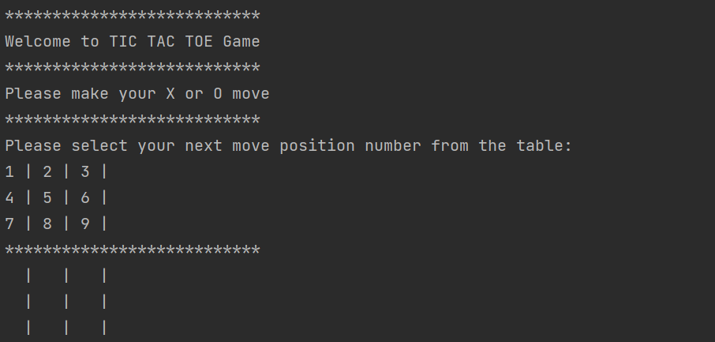
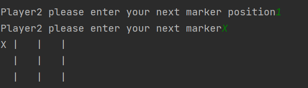
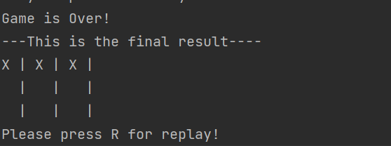
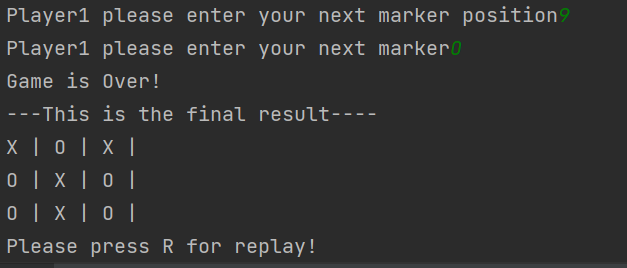

# Tic Tac Toe Console Game!
This is a console Tic Tac Toe game developed in python.
To get more information about Tic Tac Toe game, please click [here](https://www.wikiwand.com/en/Tic-tac-toe)

>This game is developed by only pure Python 3 without any additional library. In order to run it, only python 3 installation will be enough

# How to Play
 - Game is played by two people.
 - Every player makes move by **X** or **O** moves.
 - There are three possible situations for win:
   - Row Match 
   - Column Match
   - Diagnose match
 - If game is over, replay is possible

## Game Insights

#### 1. Welcome:

#### 2. Player moves:

#### 3. Player wins:

#### 4. Game ends without win:

